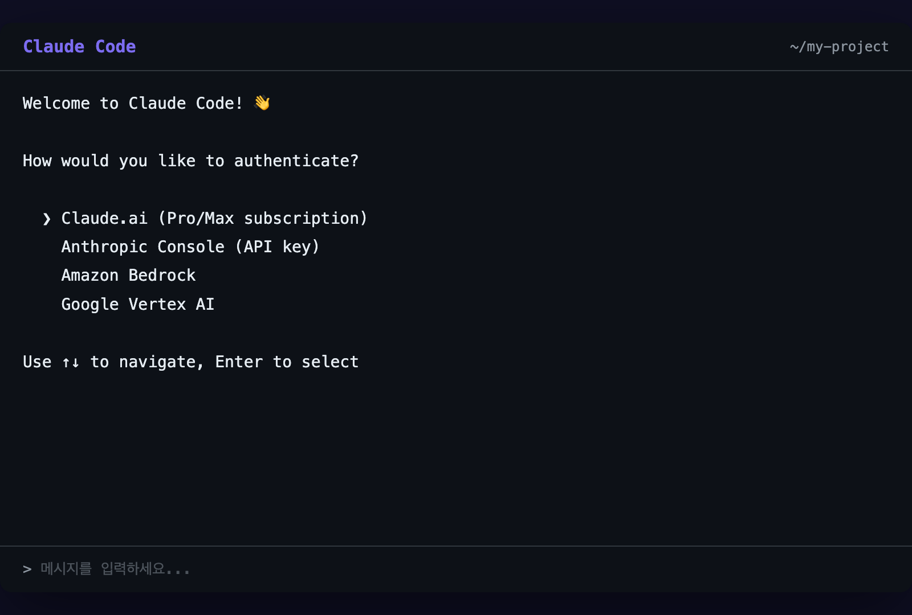

# 인증 설정

## 오늘의 목표

> Claude Code에 로그인해서 실제로 사용할 수 있는 상태를 만듭니다.

> ℹ️ **정보**
>
> **API 키는 필수가 아닙니다.** Claude Pro($20/월) 또는 Max 구독이 있으면 API 키 없이 바로 로그인해서 쓸 수 있습니다. 이 플레이북에서는 **Pro 구독을 추천**합니다.

---

## 가장 쉬운 방법: Pro 구독으로 바로 시작 (추천)

Claude Pro 구독이 있으면 **3단계면 끝**입니다.

**Step 1**: [claude.ai/settings/billing](https://claude.ai/settings/billing)에서 Pro 플랜($20/월)을 구독합니다.

**Step 2**: 터미널에서 `claude`를 실행합니다.

`claude`
**Step 3**: 인증 방법 선택 화면에서 **Claude.ai (Pro/Max subscription)**을 선택합니다.

브라우저가 열리고 Claude 계정으로 로그인하면 끝입니다. API 키를 발급받거나 입력할 필요 없이 바로 사용할 수 있습니다.

> ⚠️ **주의**
>
> **중요**: Claude 웹/앱과 Claude Code의 사용량이 **합산**됩니다. Claude.ai에서 많이 대화하면 Claude Code 사용량도 줄어듭니다. `/status` 명령으로 남은 사용량을 확인할 수 있습니다.

---

## 플랜 비교

| 플랜 | 월 가격 | API 키 필요? | 사용량 | 리셋 주기 | 추천 대상 |
| --- | --- | --- | --- | --- | --- |
| **Pro** | $20 | 불필요 | 기본 | 5~8시간 | 이 플레이북 따라하기에 충분 |
| **Max 5x** | $100 | 불필요 | Pro의 5배 | 7일 | 매일 1~2시간 사용 |
| **Max 20x** | $200 | 불필요 | Pro의 20배 | 7일 | 하루 종일 개발에 사용 |
| **API 키** | 사용량 기반 | 필요 | 무제한 | - | 개발자, 팀 대량 사용 |

처음 시작한다면 **Pro로 충분**합니다. 써보다가 부족하면 업그레이드하면 됩니다.

---

## API 키가 필요한 경우 (개발자용)

Pro/Max 구독 대신 **쓴 만큼만 내는** 방식을 원한다면 API 키를 발급받습니다. 개발자에게 익숙한 방법입니다.

> ℹ️ **정보**
>
> Pro/Max 구독으로 쓸 거라면 이 섹션은 건너뛰어도 됩니다. [IDE 연동]({{ '/docs/day-0/ide-setup.html' | relative_url }})으로 넘어가세요.

### 1단계: Anthropic 콘솔 접속

[console.anthropic.com](https://console.anthropic.com)에 접속합니다.

계정이 없다면 회원가입을 먼저 합니다. 이메일과 비밀번호만 있으면 됩니다.

### 2단계: 결제 정보 등록

처음 사용하면 결제 수단을 등록해야 합니다.

좌측 메뉴에서 **Billing**을 찾아 클릭하세요. 신용카드 정보를 입력합니다.

> ℹ️ **정보**
>
> 카드를 등록해도 바로 결제되지 않습니다. 실제로 사용한 만큼만 나중에 청구됩니다. 처음에 **$5 크레딧을 충전**하면 이 플레이북 전체를 따라하기에 충분합니다.

### 3단계: API 키 생성

1. 좌측 메뉴에서 **API Keys**를 클릭합니다

1. **Create Key** 버튼을 누릅니다

1. 키 이름을 입력합니다 (예: `my-claude-code`)

1. **Create** 버튼을 누릅니다

화면에 `sk-ant-`로 시작하는 긴 문자열이 나타납니다. **이게 API 키입니다**.

### 4단계: 키 복사하기

이 키는 **이 순간에만 볼 수 있습니다**. 페이지를 벗어나면 다시 볼 수 없습니다.

반드시 지금 복사하세요. 메모장이나 비밀번호 관리 앱에 저장해두면 좋습니다.

> ⚠️ **주의**
>
> 키를 복사하지 않고 페이지를 닫았다면, 걱정 마세요. 기존 키를 삭제하고 새로 만들면 됩니다.

### 5단계: Claude Code에 키 등록하기

터미널에서 `claude`를 실행하면 인증 방법 선택이 나옵니다. **Anthropic Console (API key)**를 선택하고 키를 붙여넣으면 됩니다.

또는 환경 변수로 직접 등록할 수도 있습니다:

`# Mac / Linux
export ANTHROPIC_API_KEY="sk-ant-여기에-복사한-키를-붙여넣으세요"`
`# Windows (PowerShell)
$env:ANTHROPIC_API_KEY="sk-ant-여기에-복사한-키를-붙여넣으세요"`
매번 입력하기 귀찮다면, 셸 설정 파일에 영구 저장합니다:

`# Mac (zsh)
echo 'export ANTHROPIC_API_KEY="sk-ant-여기에키"' >> ~/.zshrc
source ~/.zshrc`
> ⚠️ **주의**
>
> **Pro/Max 구독자 주의**: 시스템에 `ANTHROPIC_API_KEY` 환경변수가 설정되어 있으면, 구독이 아닌 **API 키로 과금**됩니다. Pro/Max 구독으로 쓰고 싶다면 환경변수를 삭제하세요:
> 
> `# Mac/Linux
> unset ANTHROPIC_API_KEY`기존 API 키에서 구독으로 전환하려면: `claude logout` 후 `claude login`

---

## 연결 확인

어떤 방법으로든 인증을 마쳤으면 확인해봅시다:

`claude`
Claude Code가 실행되면서 대화 화면이 나타나면 성공입니다. `Ctrl + C` 또는 `/exit`을 입력하면 종료됩니다.

---

## API 키 요금 참고

API 키로 사용할 경우, 쓴 만큼만 과금됩니다. 참고용으로:

| 사용 예시 | 대략적 비용 |
| --- | --- |
| 간단한 질문 10개 | $0.10 이하 |
| 파일 하나 만들기 | $0.05 ~ $0.20 |
| 이 플레이북 하루치 실습 | $0.50 ~ $1.00 |
| 7일 전체 따라하기 | $3 ~ $5 |

> ℹ️ **정보**
>
> Anthropic 콘솔에서 **Spending Limit**을 $10으로 설정해두면 안심입니다. 이 플레이북을 따라하는 데 충분하고, 실수로 큰 비용이 나갈 걱정이 없습니다.

---

## 보안: API 키를 절대 공유하지 마세요

API 키를 사용하는 경우, 키는 **여러분의 결제 수단에 연결**되어 있습니다.

키가 유출되면 다른 사람이 여러분 돈으로 AI를 쓸 수 있습니다. 절대로:

- 카카오톡, 슬랙, 디스코드에 키를 보내지 마세요

- GitHub에 키가 포함된 코드를 올리지 마세요

- 블로그나 SNS에 키를 노출하지 마세요

만약 유출되었다면 [console.anthropic.com](https://console.anthropic.com)에서 해당 키를 즉시 **삭제(Revoke)**하고 새로 만드세요.

---

## 정리

- **Pro/Max 구독이 있으면 API 키 없이** `claude` 실행 → 로그인으로 바로 시작

- API 키는 사용량 기반 과금을 원하는 개발자용 옵션

- 처음 시작한다면 **Pro($20/월) 추천** — 이 플레이북 따라하기에 충분

- Pro/Max와 API 키를 동시에 쓸 때는 환경변수 설정에 주의

다음 페이지는 선택 사항입니다. 건너뛰어도 괜찮습니다.

-> [IDE 연동 (선택)]({{ '/docs/day-0/ide-setup.html' | relative_url }})
