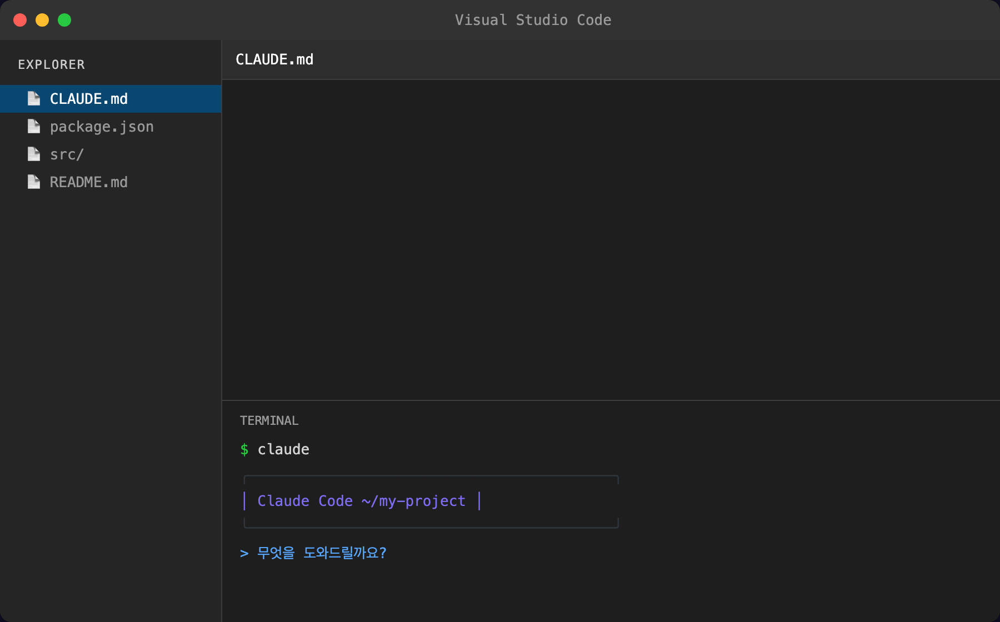

# IDE 연동 (선택)

## 오늘의 목표

> VS Code에서 Claude Code를 편하게 쓰는 환경을 만듭니다.

> ℹ️ **정보**
>
> 이 페이지는 **선택 사항**입니다. 터미널만으로도 Claude Code를 100% 사용할 수 있습니다. VS Code를 이미 쓰고 있거나, 좀 더 편한 환경이 필요하다면 읽어보세요.

---

## IDE가 뭔가요?

IDE는 코드를 편하게 쓸 수 있도록 도와주는 프로그램입니다. 워드 프로세서가 글쓰기를 편하게 해주는 것처럼, IDE는 코드 작업을 편하게 해줍니다.

대표적인 IDE가 **VS Code** (Visual Studio Code)입니다. 무료이고, 가장 많이 쓰입니다.

꼭 IDE가 필요한 건 아닙니다. 하지만 파일 목록을 한눈에 보면서 Claude Code와 대화할 수 있어서, 작업이 좀 더 수월해집니다.

---

## VS Code 설치

이미 설치되어 있다면 건너뛰세요.

1. [code.visualstudio.com](https://code.visualstudio.com)에 접속합니다

1. 운영체제에 맞는 버전을 다운로드합니다

1. 설치합니다 (Next, Next, Install)

---

## VS Code에서 터미널 열기

VS Code의 핵심 장점은 **에디터와 터미널이 한 화면에** 있다는 겁니다.

### 터미널 여는 법

1. VS Code를 실행합니다

1. 상단 메뉴에서 **Terminal** > **New Terminal**을 클릭합니다

1. 또는 단축키를 누릅니다:
  
    - Mac: `Ctrl + `` (백틱, 숫자 1 왼쪽 키)
  
    - Windows/Linux: `Ctrl + ``

화면 아래에 터미널이 나타납니다. 여기에 `claude`를 입력하면 Claude Code가 실행됩니다.

### 폴더 열기

Claude Code는 **현재 위치한 폴더**를 기준으로 작업합니다. 그래서 작업할 폴더를 먼저 열어두는 게 좋습니다.

1. VS Code에서 **File** > **Open Folder**를 클릭합니다

1. 작업할 폴더를 선택합니다 (없으면 바탕화면에 새 폴더를 하나 만드세요)

1. 터미널을 열면 자동으로 그 폴더 위치에서 시작합니다

이제 왼쪽에는 파일 목록, 아래에는 Claude Code 대화 창이 보입니다. Claude Code가 파일을 만들면 왼쪽 목록에 바로 나타납니다.

---

## VS Code 확장 프로그램

VS Code에서 Claude Code를 더 편하게 쓸 수 있는 확장 프로그램이 있습니다.

### Claude Code 확장 프로그램 설치

1. VS Code 왼쪽의 네모 아이콘 (Extensions)을 클릭합니다

1. 검색창에 `Claude Code`를 입력합니다

1. Anthropic에서 만든 공식 확장 프로그램을 설치합니다

이 확장을 설치하면:

- 사이드바에서 바로 Claude Code와 대화할 수 있습니다

- 코드를 선택한 뒤 “Claude에게 물어보기”를 할 수 있습니다

- 터미널을 따로 열 필요가 줄어듭니다

> ℹ️ **정보**
>
> 확장 프로그램 없이 터미널에서 `claude`를 실행해도 동일한 기능을 사용할 수 있습니다. 확장 프로그램은 편의 기능일 뿐, 필수가 아닙니다.

---

## 터미널만으로도 충분한 이유

IDE 없이 터미널만 사용해도 전혀 문제없습니다. 이유를 알려드리면:

1. **Claude Code가 파일 관리를 대신 합니다** — 파일을 직접 찾아다닐 일이 적습니다

1. **Claude Code에게 물어보면 됩니다** — “방금 만든 파일 내용 보여줘”라고 하면 보여줍니다

1. **이 플레이북의 모든 실습은 터미널 기준입니다** — IDE가 없어도 따라할 수 있습니다

특히 코딩 경험이 없다면, 오히려 터미널 하나에 집중하는 게 더 편할 수 있습니다.

---

## 다른 IDE도 됩니다

VS Code 외에 다른 도구를 쓰고 있다면:

### JetBrains (IntelliJ, WebStorm 등)

JetBrains IDE에도 내장 터미널이 있습니다. 하단의 Terminal 탭에서 `claude`를 실행하면 됩니다. JetBrains용 Claude Code 플러그인도 제공됩니다.

### Cursor

Cursor는 AI 기능이 내장된 코드 에디터입니다. Cursor 자체에도 AI 기능이 있지만, 터미널에서 Claude Code를 별도로 실행할 수 있습니다. 두 AI를 같이 쓰는 것도 가능합니다.

### Windsurf, Zed 등

터미널이 내장된 에디터라면 어디서든 Claude Code를 실행할 수 있습니다. 특별한 설정은 필요 없습니다.

---

## 추천 설정

어떤 도구를 쓰든, 이 설정만 해두면 편합니다:

### 1. 터미널 글꼴 크기 키우기

Claude Code의 출력을 오래 읽어야 하므로, 눈이 편한 크기로 설정하세요.

- VS Code: Settings > Terminal > Font Size를 14~16으로

### 2. 자동 저장 켜기

Claude Code가 파일을 수정하면 에디터에 바로 반영되도록, 자동 저장을 켜두세요.

- VS Code: Settings에서 `Auto Save`를 검색 > `afterDelay`로 설정

### 3. 작업 폴더 정하기

앞으로의 실습을 위해 폴더 하나를 미리 만들어두면 좋습니다:

`mkdir ~/claude-playground
cd ~/claude-playground`
Day 1부터 이 폴더에서 작업할 예정입니다.

---

## 정리

- VS Code를 쓰면 파일 목록과 터미널을 한 화면에서 볼 수 있습니다

- Claude Code 확장 프로그램을 설치하면 더 편리합니다

- 하지만 **터미널만으로도 충분**합니다

- JetBrains, Cursor 등 다른 도구도 사용 가능합니다

- 작업 폴더(`~/claude-playground`)를 하나 만들어두세요

---

## Day 0 완료!

축하합니다. Claude Code를 쓸 준비가 모두 끝났습니다.

오늘 한 것을 정리하면:

1. Claude Code가 뭔지 이해했습니다

1. Claude Code를 설치했습니다 (Native Installer)

1. API 키를 발급받거나 Pro/Max 구독으로 연결했습니다

1. (선택) IDE 환경을 설정했습니다

내일 Day 1에서는 Claude Code와 **첫 대화**를 나눠봅니다. “안녕”이라고 말하는 것부터 시작해서, 실제로 파일을 하나 만들어봅니다.

-> [Day 1 - 첫 대화 나누기]({{ '/docs/day-1.html' | relative_url }})
