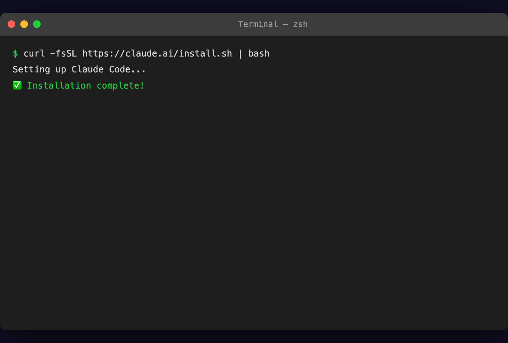
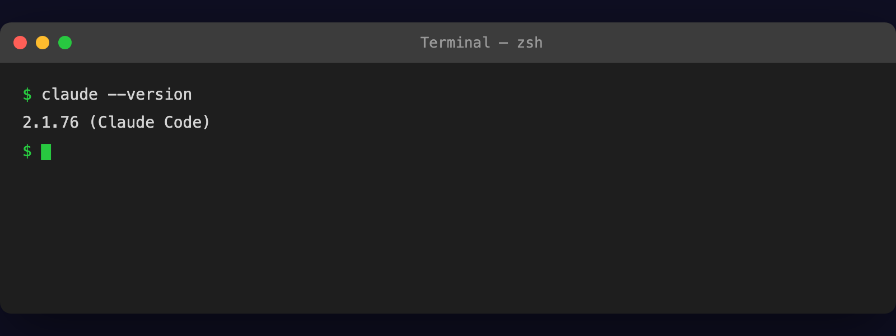
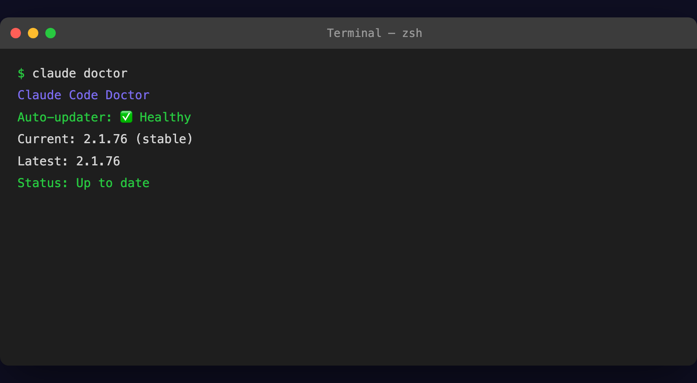

# 설치하기

## 오늘의 목표

> 내 컴퓨터에 Claude Code를 설치하고, 정상 작동하는지 확인합니다.

5분이면 끝납니다. 천천히 따라오세요.

---

## 시스템 요구사항

먼저 내 컴퓨터가 조건을 충족하는지 확인합니다.

| 항목 | 요구사항 |
| --- | --- |
| **운영체제** | macOS 13.0+, Windows 10 (1809+), Ubuntu 20.04+, Debian 10+ |
| **RAM** | 4GB 이상 |
| **네트워크** | 인터넷 연결 필수 |
| **Windows 추가** | [Git for Windows](https://gitforwindows.org) 선설치 필수 |

> ℹ️ **정보**
>
> 예전에는 Node.js를 먼저 설치해야 했지만, 지금은 **필요 없습니다**. 아래 Native Installer를 사용하면 Node.js 없이 바로 설치됩니다.

---

## Claude Code 설치 (Native Installer)

2026년 1월부터 공식 권장 방법이 바뀌었습니다. **Native Installer**는 Node.js 없이 설치되고, 자동 업데이트도 지원합니다.

### Mac / Linux

터미널을 열고 이 한 줄을 복사해서 붙여넣으세요:

`curl -fsSL https://claude.ai/install.sh | bash`

### Windows (PowerShell)

PowerShell을 **관리자 권한**으로 열고 입력하세요:

`irm https://claude.ai/install.ps1 | iex`
### Windows (CMD)

명령 프롬프트를 사용한다면:

`curl -fsSL https://claude.ai/install.cmd -o install.cmd && install.cmd && del install.cmd`
> ⚠️ **주의**
>
> **Windows 사용자**: 반드시 [Git for Windows](https://gitforwindows.org)를 먼저 설치하세요. 없으면 Claude Code가 정상 작동하지 않습니다.

설치가 완료되면 터미널을 **닫았다가 다시 여세요**.

---

## 다른 설치 방법

Native Installer가 가장 좋지만, 익숙한 패키지 매니저를 쓰고 싶다면 다른 방법도 있습니다.

### Homebrew (Mac)

`brew install --cask claude-code`
자동 업데이트가 안 되므로 `brew upgrade claude-code`로 직접 업데이트해야 합니다.

### WinGet (Windows)

`winget install Anthropic.ClaudeCode`
마찬가지로 `winget upgrade Anthropic.ClaudeCode`로 직접 업데이트합니다.

### npm (레거시 — 비권장)

> ⚠️ **주의**
>
> npm 설치는 **2026년 1월 15일부로 deprecated**되었습니다. 기존에 npm으로 설치한 분은 Native로 전환을 권장합니다.

`# 기존 npm 사용자: Native로 전환하기
curl -fsSL https://claude.ai/install.sh | bash
npm uninstall -g @anthropic-ai/claude-code`
npm으로 새로 설치하려면 Node.js 18 이상이 필요합니다:

`npm install -g @anthropic-ai/claude-code`
---

## 설치 확인

설치가 끝났으면 확인해봅시다:

`claude --version`

버전 번호가 나오면 성공입니다. 더 자세한 진단을 하려면:

`claude doctor`

`claude doctor`는 설치 상태, 인증, 네트워크 연결 등을 종합적으로 점검해줍니다. 문제가 있으면 해결 방법도 알려줍니다.

축하합니다! Claude Code가 설치되었습니다.

---

## 잘 안 될 때: 흔한 에러 3가지

### 에러 1: `command not found: claude`

설치는 됐는데 `claude` 명령어를 못 찾는 경우입니다.

**해결법**:

1. 터미널을 **완전히 닫고 다시 엽니다** (가장 흔한 원인)

1. 그래도 안 되면 설치 스크립트를 다시 실행합니다:

`curl -fsSL https://claude.ai/install.sh | bash`

1. `claude doctor`를 실행해서 경로 문제를 확인합니다

### 에러 2: Windows에서 설치 후 작동 안 함

대부분 Git for Windows가 없어서 생기는 문제입니다.

**해결법**:

1. [gitforwindows.org](https://gitforwindows.org)에서 Git을 설치합니다

1. 설치 후 **PowerShell을 새로 엽니다**

1. `git --version`으로 Git이 인식되는지 확인합니다

1. 다시 `claude`를 실행합니다

### 에러 3: 네트워크/프록시 에러

회사 네트워크나 VPN 환경에서 설치 스크립트가 막히는 경우입니다.

**해결법**:

1. VPN을 잠시 끄고 다시 시도합니다

1. 그래도 안 되면 Homebrew(Mac) 또는 WinGet(Windows)으로 설치합니다

1. `claude doctor`로 네트워크 연결 상태를 점검합니다

> ℹ️ **정보**
>
> 막히는 부분이 있으면 `claude doctor`의 결과를 복사해서 Claude.ai에 붙여넣어 보세요. 대부분의 설치 문제는 이 방법으로 해결됩니다.

---

## 정리

- **Native Installer**로 설치합니다 (Node.js 불필요, 자동 업데이트)

- Mac/Linux: `curl -fsSL https://claude.ai/install.sh | bash`

- Windows: PowerShell에서 `irm https://claude.ai/install.ps1 | iex`

- `claude --version`으로 설치를 확인합니다

- 문제가 있으면 `claude doctor`로 진단합니다

- 기존 npm 사용자는 Native로 전환을 권장합니다

설치가 되었으면, 다음은 API 키를 발급받을 차례입니다.

-> [API 키 발급](/docs/day-0/api-key)
