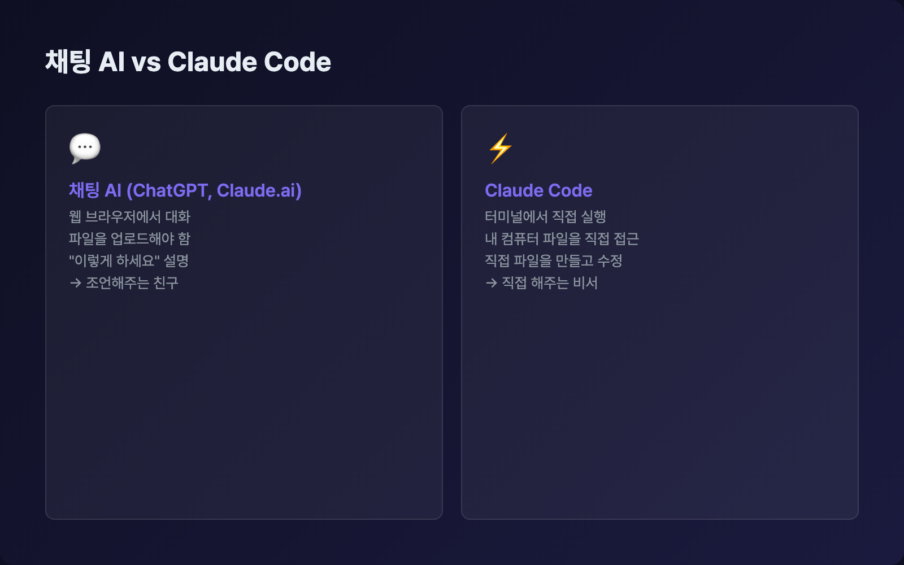

# Claude Code가 뭔가요?

## 오늘의 목표

> Claude Code가 뭔지 이해하고, 설치 준비를 마칩니다.

아직 아무것도 설치하지 않아도 됩니다. 이 페이지에서는 **개념만 잡고 갑니다**.

> ⚠️ **주의**
>
> **Claude Code는 유료 서비스입니다.** 설치는 무료지만, 실제 사용하려면 다음 중 하나가 필요합니다:
> 
> 
> - **Claude Pro 구독** — 월 $20 (가장 간편, 이 플레이북 기준 추천)
> 
> - **Claude Max 구독** — 월 $100(Max 5x) 또는 $200(Max 20x) (헤비 유저용)
> 
> - **Anthropic API 키** — 사용한 만큼만 과금 (개발자용, $5 충전이면 이 플레이북을 충분히 따라할 수 있습니다)
> 
> 
> Day 0의 [API 키 설정]({{ '/docs/day-0/api-key.html' | relative_url }}) 페이지에서 자세히 다룹니다. 지금은 “유료구나” 정도만 알고 넘어가세요.

---

## 채팅 AI vs Claude Code

ChatGPT나 Claude.ai를 써보셨나요? 브라우저에서 대화하는 그 AI 말입니다.

이런 채팅 AI는 **조언을 해주는 친구**입니다. “이거 어떻게 해?” 하면 방법을 알려줍니다. 하지만 직접 해주진 않습니다. 복사해서 붙여넣는 건 여러분 몫이죠.

Claude Code는 다릅니다. **직접 일을 해주는 비서**입니다.

|  | 채팅 AI (ChatGPT, Claude.ai) | Claude Code |
| --- | --- | --- |
| 대화 장소 | 웹 브라우저 | 터미널 (내 컴퓨터) |
| 파일 접근 | 파일을 업로드해야 함 | 내 컴퓨터 파일을 직접 읽고 수정 |
| 작업 방식 | ”이렇게 하세요” 설명 | 직접 파일을 만들고 고침 |
| 비유 | 조언해주는 친구 | 직접 해주는 비서 |

예를 들어볼게요.

**채팅 AI에게**: “HTML 파일 만들어줘”

- AI가 코드를 보여줍니다

- 여러분이 복사합니다

- 메모장에 붙여넣고 저장합니다

**Claude Code에게**: “HTML 파일 만들어줘”

- Claude Code가 직접 파일을 만듭니다

- 이미 저장되어 있습니다

- 끝입니다

이 차이가 전부입니다. **내 컴퓨터에서 직접 작업하느냐, 아니냐**.

---

## 터미널이 뭔가요?

Claude Code는 **터미널**에서 실행됩니다. 터미널이 뭔지 모르셔도 괜찮습니다.

터미널은 컴퓨터에게 글자로 명령을 내리는 창입니다. 마우스로 클릭하는 대신, 글자를 입력해서 컴퓨터를 조작합니다.

- **Mac**: `Command + Space` 누르고 “터미널” 검색

- **Windows**: 시작 메뉴에서 “명령 프롬프트” 또는 “PowerShell” 검색

- **Linux**: `Ctrl + Alt + T`

검은 화면에 깜빡이는 커서가 보이면, 그게 터미널입니다.

> ℹ️ **정보**
>
> 터미널이 무섭게 느껴질 수 있습니다. 하지만 Claude Code를 쓰면 터미널에서 할 일이 거의 없습니다. `claude`라고 입력하면, 그 다음부턴 **한국어로 대화**하면 됩니다.

---

## Claude Code로 할 수 있는 것 5가지

구체적으로 어떤 일을 시킬 수 있는지 볼까요?

### 1. 파일 만들기와 수정하기

“보고서 양식 만들어줘”, “이 엑셀 데이터를 정리해줘” 같은 작업입니다. Claude Code가 내 컴퓨터에 바로 파일을 만들어줍니다.

### 2. 코드 작성하기

프로그래밍을 몰라도 됩니다. “간단한 웹사이트 만들어줘”라고 하면, 필요한 파일을 전부 만들어줍니다. 이 플레이북 사이트도 Claude Code로 만들었습니다.

### 3. 기존 프로젝트 분석하기

폴더를 열어놓고 “이 프로젝트가 뭘 하는 건지 설명해줘”라고 하면, 파일을 하나하나 읽고 전체 구조를 설명해줍니다.

### 4. 에러 고치기

“이거 실행하면 에러가 나는데, 고쳐줘”라고 하면 에러를 읽고, 원인을 찾고, 코드를 직접 수정합니다.

### 5. 반복 작업 자동화하기

“이 폴더에 있는 이미지 파일 이름을 전부 날짜 형식으로 바꿔줘” 같은 작업도 됩니다. 파일이 100개여도 한 번에 처리합니다.

---

## Claude Code로 못 하는 것

기대치를 맞춰두는 게 중요합니다.

- **인터넷 검색을 직접 하진 못합니다** — 실시간 뉴스나 최신 가격 조회 같은 건 기본적으로 안 됩니다 (나중에 MCP라는 기능으로 확장할 수 있습니다)

- **GUI 프로그램을 조작하진 못합니다** — 포토샵을 대신 클릭해주거나, 엑셀 버튼을 눌러주진 않습니다

- **100% 완벽하진 않습니다** — 가끔 실수합니다. 그래서 중요한 파일은 항상 확인하는 습관이 필요합니다

- **내 컴퓨터 밖의 서버에 직접 접근하진 못합니다** — 내 컴퓨터 안에서만 일합니다

> ⚠️ **주의**
>
> Claude Code는 강력하지만, 마법이 아닙니다. “AI가 다 해주겠지”가 아니라 “AI에게 잘 시키는 법”을 배우는 게 이 플레이북의 핵심입니다.

---

## AI싱크클럽은 이걸 어떻게 쓰고 있나요?

AI싱크클럽에서는 Claude Code로 **23개 AI 에이전트**를 만들어서 유튜브 채널을 운영합니다.

- 트렌드를 분석하는 에이전트

- 대본을 쓰는 에이전트

- 썸네일 문구를 만드는 에이전트

- SNS 포스트를 생성하는 에이전트

이 모든 게 Claude Code 안에서 돌아갑니다. Day 6에서 여러분도 직접 에이전트를 만들어봅니다. 지금은 “이런 것도 되는구나” 정도만 기억해주세요.

---

## 정리

- Claude Code는 **내 컴퓨터에서 직접 작업해주는 AI**입니다

- 채팅 AI와 달리 파일을 직접 만들고, 읽고, 수정합니다

- 터미널에서 실행하지만, 대화는 한국어로 합니다

- 강력하지만 한계도 있으니 적절한 기대치를 갖는 게 좋습니다

다음 페이지에서 실제로 설치해봅시다.

-> [설치하기]({{ '/docs/day-0/installation.html' | relative_url }})
