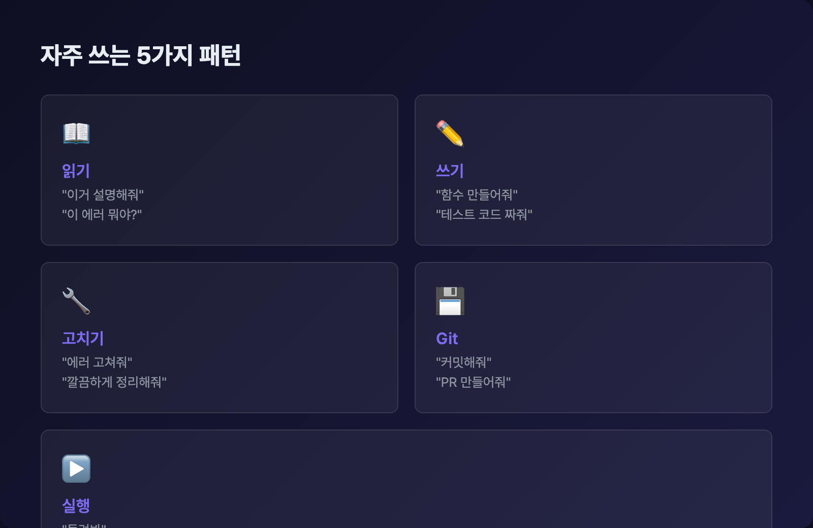

# 자주 쓰는 명령어

## 오늘의 목표

> Claude Code에서 가장 많이 쓰는 패턴 5가지를 익히기

Claude Code에 말하는 방식에는 정해진 문법이 없습니다. 하지만 **자주 쓰이는 패턴**은 있습니다. 이 패턴만 알면 대부분의 작업을 할 수 있습니다.

---

## 패턴 1: 읽기 — “이거 설명해줘”

코드를 이해하고 싶을 때 쓰는 패턴입니다.

`이 코드 설명해줘          → 코드를 한국어로 풀어서 설명
src/index.js 설명해줘     → 특정 파일을 지정해서 설명
이 에러 뭐야? [에러 붙여넣기]  → 에러 원인과 해결 방법
이 프로젝트 전체적으로 설명해줘  → 폴더 구조와 목적 분석`
에러 메시지가 영어여도 괜찮습니다. Claude가 한국어로 풀어서 설명해줍니다. 그대로 붙여넣으세요.

---

## 패턴 2: 쓰기 — “이거 만들어줘”

새로운 코드나 파일을 만들 때 쓰는 패턴입니다.

`두 숫자를 더하는 함수 만들어줘                        → 간단한 요청
이메일 확인 함수 만들어줘. utils.py에 넣어줘.          → 구체적 요청
validate_email 함수의 테스트 코드 짜줘                → 테스트 생성`
요청이 구체적일수록 원하는 결과에 가까워집니다.

테스트가 뭔지 모르셔도 됩니다. “내가 만든 코드가 제대로 작동하는지 확인하는 코드”라고 생각하면 됩니다.

---

## 패턴 3: 고치기 — “이거 고쳐줘”

문제가 있는 코드를 수정할 때 쓰는 패턴입니다.

`이 코드가 에러가 나. 고쳐줘.                           → 기본 버그 수정
calculate_total에서 TypeError가 나. 고쳐줘.            → 상세 에러 전달
이 코드 좀 깔끔하게 정리해줘                            → 리팩토링
이 함수가 너무 느려. 더 빠르게 만들어줘.                  → 성능 개선`
에러와 함께 상황을 알려주면 더 정확하게 고쳐줍니다.

---

## 패턴 4: Git — “커밋해줘”

코드 변경 사항을 기록할 때 쓰는 패턴입니다.

Git이 뭔지 모르셔도 괜찮습니다. 간단히 말하면 **파일 변경 기록을 저장하는 시스템**입니다. “저장” 버튼을 누르는 것과 비슷하다고 생각하세요. Day 2에서 더 자세히 다룹니다.

### 변경 사항 저장

`지금까지 바꾼 거 커밋해줘`
Claude가 변경된 파일을 확인하고, 적절한 커밋 메시지를 만들어서 저장합니다.

### 변경 내역 확인

`뭐가 바뀌었는지 보여줘`
### PR 만들기

`이 변경사항으로 PR 만들어줘`
PR(Pull Request)은 “이렇게 바꿨는데 확인해주세요”라는 요청입니다. 팀으로 일할 때 씁니다.

---

## 패턴 5: 실행 — “돌려봐”

코드를 실행하거나 테스트할 때 쓰는 패턴입니다.

### 코드 실행

`이거 실행해봐`
또는 특정 파일을 지정해서:

`hello.py 실행해봐`
### 테스트 실행

`테스트 돌려봐`
프로젝트에 테스트가 설정되어 있으면 Claude가 알아서 실행합니다.

### 서버 실행

`개발 서버 켜줘`
웹 프로젝트에서 로컬 서버를 띄울 때 씁니다.

---

## 패턴 조합하기

이 패턴들은 **연속으로 쓸 때** 진짜 힘을 발휘합니다:

`1. "이 코드 설명해줘"          → 파악
2. "이 부분에 버그가 있는 것 같아" → 진단
3. "고쳐줘"                    → 수정
4. "테스트 돌려봐"              → 확인
5. "커밋해줘"                  → 저장`
한 번의 대화 안에서 이 흐름을 자연스럽게 이어갈 수 있습니다.

## 실습 과제

앞에서 만든 `~/claude-practice` 폴더에서 다음을 해보세요:

1. “계산기 프로그램 만들어줘. 더하기, 빼기, 곱하기, 나누기가 되는 걸로.” (쓰기)

1. “만든 코드 설명해줘” (읽기)

1. “0으로 나누면 에러가 날 것 같은데, 고쳐줘” (고치기)

1. “실행해봐” (실행)

1. “테스트도 만들어줘” (쓰기)

1. “테스트 돌려봐” (실행)

이 여섯 단계가 Claude Code를 쓰는 기본 흐름입니다. 어떤 프로젝트든 이 패턴의 반복입니다.

---

## 정리

오늘 배운 5가지 패턴을 정리합니다:

| 패턴 | 대표 문장 | 언제 쓰나 |
| --- | --- | --- |
| **읽기** | ”설명해줘”, “이거 뭐야?” | 코드를 이해할 때 |
| **쓰기** | ”만들어줘”, “짜줘” | 새 코드가 필요할 때 |
| **고치기** | ”고쳐줘”, “정리해줘” | 문제를 수정할 때 |
| **Git** | ”커밋해줘”, “PR 만들어줘” | 작업을 저장할 때 |
| **실행** | ”돌려봐”, “테스트해봐” | 결과를 확인할 때 |

이 다섯 가지면 Claude Code로 할 수 있는 일의 90%를 커버합니다. 다음으로 슬래시 커맨드를 배워서 더 빠르게 조작하는 법을 익혀봅시다.

> [다음: 슬래시 커맨드 익히기 →](/docs/day-1/slash-commands)
