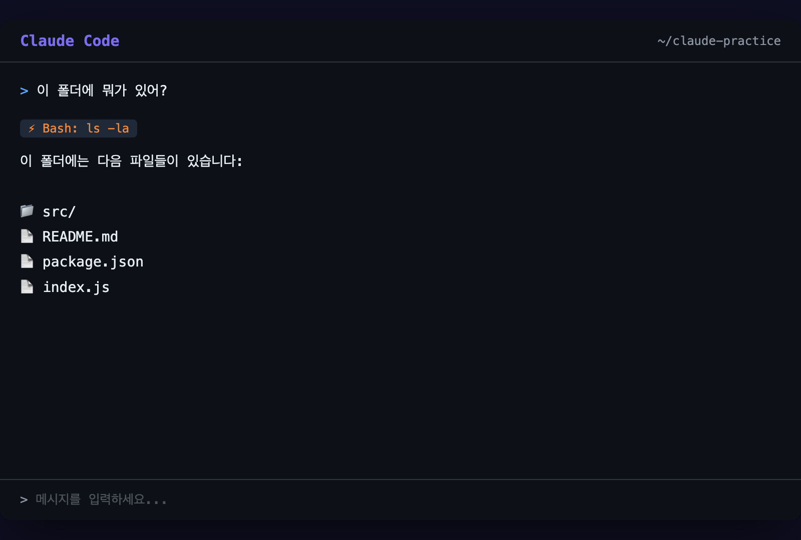
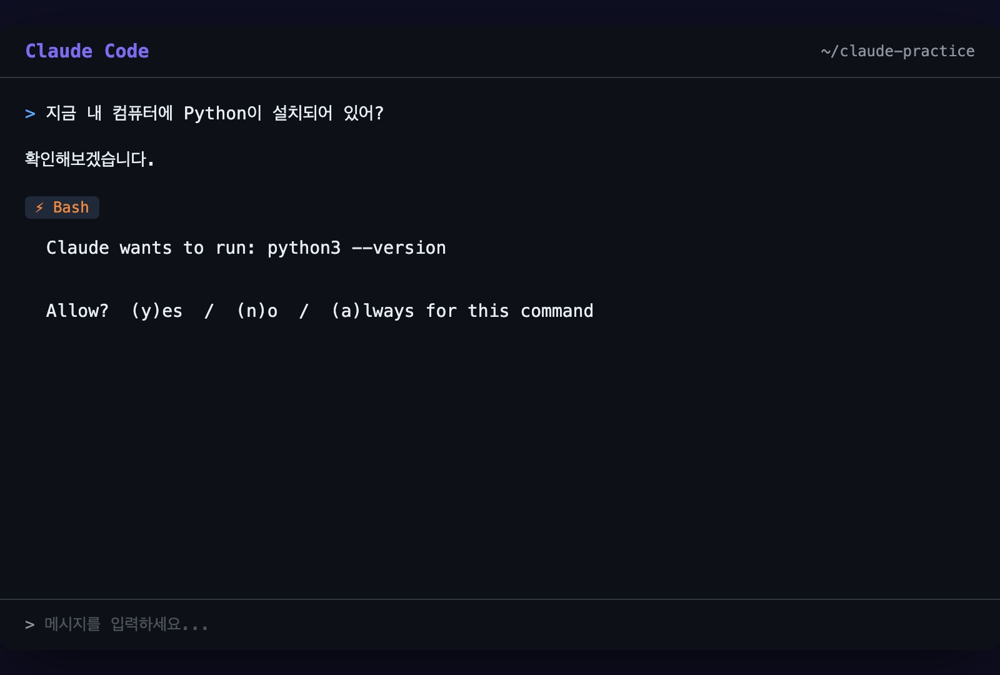

# 첫 번째 대화 나누기

## 오늘의 목표

> Claude Code와 첫 대화를 나누고, 인터페이스에 익숙해지기

Day 0에서 설치를 마쳤으니, 이제 진짜 시작입니다. 처음 말을 걸어봅시다.

---

## 터미널에서 Claude Code 실행하기

터미널을 열고 아무 폴더에서 이렇게 입력하세요:

`claude`
그게 전부입니다. 엔터를 누르면 Claude Code가 시작됩니다.

> ℹ️ **정보**
>
> 어떤 폴더에서 실행하느냐가 중요합니다. Claude Code는 **현재 폴더를 작업 공간**으로 인식합니다. 바탕화면에서 실행하면 바탕화면이 작업 공간이 됩니다.

## 처음 나타나는 화면

실행하면 이런 화면이 나타납니다:

`╭────────────────────────────────────────────╮
│  Claude Code                               │
│                                            │
│  /Users/내이름/Documents                    │  ← 현재 작업 폴더
│                                            │
│  > 여기에 입력합니다                         │  ← 입력창
╰────────────────────────────────────────────╯`

복잡한 메뉴도, 버튼도 없습니다. **채팅창 하나**가 전부예요.

핵심 구조는 딱 세 가지입니다:

| 영역 | 설명 |
| --- | --- |
| **상단** | 현재 어떤 폴더에서 작업 중인지 보여줍니다 |
| **가운데** | Claude의 답변이 나타나는 곳입니다 |
| **하단** | 내가 질문이나 요청을 입력하는 곳입니다 |

## 첫 번째 질문 던져보기

입력창에 이렇게 써보세요:

`이 폴더에 뭐가 있어?`
엔터를 누르면 Claude가 현재 폴더의 파일 목록을 보여줍니다.

`이 폴더에는 다음 파일들이 있습니다:

- README.md
- package.json
- src/
  - index.js
  - utils.js`
> ⚠️ **주의**
>
> 폴더에 아무것도 없다면 “이 폴더는 비어 있습니다”라고 답합니다. 정상이에요! 나중에 파일을 만들면 됩니다.

## Claude가 답하는 방식 이해하기

여기서 중요한 개념 하나를 짚고 넘어갑시다.

Claude Code는 질문을 받으면 **도구(Tool)를 사용**합니다. 방금 “이 폴더에 뭐가 있어?”라고 물었을 때, Claude는 이런 순서로 움직였습니다:

`1. "폴더 내용을 알아야겠다" 판단
2. 파일 목록을 보는 도구 사용 (ls 명령어 같은 것)
3. 결과를 읽고 정리
4. 우리에게 답변`
화면에 `Read`, `Write`, `Bash` 같은 단어가 잠깐 나타나는 걸 볼 수 있습니다. 이게 바로 Claude가 사용하는 도구 이름입니다. 지금은 “아, 도구를 쓰는구나” 정도만 알면 됩니다.

## 권한을 물어볼 때

Claude Code가 파일을 수정하거나 명령어를 실행하려고 하면, 이런 메시지가 나타납니다:

`Claude wants to run: ls -la
Allow? (y/n)`

| 선택 | 의미 |
| --- | --- |
| **y** | ”해도 돼” — 해당 작업을 허용합니다 |
| **n** | ”하지 마” — 해당 작업을 거부합니다 |

처음에는 뭘 허용하는 건지 긴장될 수 있어요. 하지만 Claude는 **무엇을 하려는지 항상 먼저 보여줍니다**. 읽어보고 판단하면 됩니다.

> ℹ️ **정보**
>
> 파일을 읽는 건 안전합니다. 파일을 수정하거나 삭제하는 건 신중하게 판단하세요. 잘 모르겠으면 **n**을 눌러도 됩니다. Claude가 다시 물어볼 테니까요.

## 실습: 3가지 질문 연습

이제 직접 해볼 차례입니다. 아래 세 가지를 순서대로 입력해보세요.

### 질문 1: 자기소개 시키기

`너는 뭘 할 수 있어?`
Claude가 자신이 할 수 있는 것들을 설명해줍니다. 목록이 꽤 길 수 있어요.

### 질문 2: 간단한 부탁하기

`"안녕하세요"를 5개 나라 언어로 번역해줘`
코드와 상관없는 질문도 잘 답합니다. Claude Code는 **대화형 AI**이기도 하니까요.

### 질문 3: 현재 환경 파악하기

`지금 내 컴퓨터에 Python이 설치되어 있어?`
Claude가 직접 확인해보고 답해줍니다. 이때 터미널 명령어를 실행하기 위해 권한을 물어볼 수 있어요.

> ℹ️ **정보**
>
> 이 세 가지 질문을 통해 Claude Code의 성격을 파악할 수 있습니다:
> 
> 
> - **대화**할 수 있고
> 
> - **지식**이 있고
> 
> - **내 컴퓨터를 직접 확인**할 수 있다

## 대화를 끝내고 싶을 때

대화를 마치려면 두 가지 방법이 있습니다:

`/quit`
또는 키보드에서 `Ctrl + C`를 두 번 누르면 됩니다.

---

## 정리

오늘 배운 것을 정리합니다:

- `claude` 명령어로 Claude Code를 시작합니다

- 인터페이스는 채팅창 하나로 아주 단순합니다

- Claude는 **도구를 사용해서** 파일을 보고, 명령어를 실행합니다

- 권한을 물어보면 **y(허용)** 또는 **n(거부)**으로 답합니다

- 아무 질문이나 해봐도 됩니다 — 부담 없이 대화하세요

다음으로 파일을 직접 읽고 쓰는 법을 배워봅시다.

> [다음: 파일 읽고 쓰기 →]({{ '/docs/day-1/reading-and-writing.html' | relative_url }})
