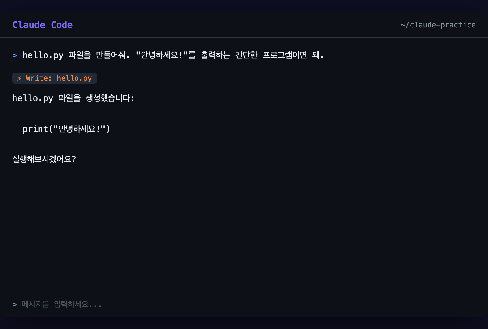
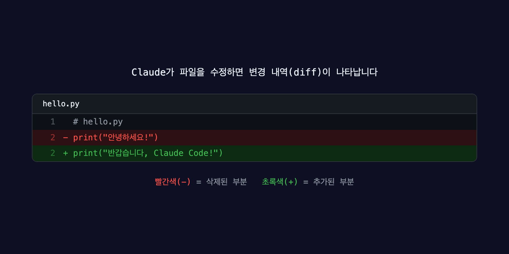

# 파일 읽고 쓰기

## 오늘의 목표

> Claude Code로 파일을 읽고, 새로 만들고, 수정하기

Claude Code의 진짜 힘은 **파일을 다루는 능력**에 있습니다. 직접 해봅시다.

---

## 실습 준비: 연습용 폴더 만들기

먼저 깨끗한 연습 공간을 만듭시다. 터미널에서 (Claude Code 밖에서) 이렇게 입력하세요:

`mkdir ~/claude-practice
cd ~/claude-practice
claude`
이제 빈 폴더에서 Claude Code가 시작됐습니다.

## 파일 만들어달라고 하기

입력창에 이렇게 써보세요:

`hello.py 파일을 만들어줘. "안녕하세요!"를 출력하는 간단한 프로그램이면 돼.`
Claude가 이런 식으로 파일을 만들어줍니다:

`# hello.py
print("안녕하세요!")`
화면에 `Write` 도구가 사용되는 걸 볼 수 있습니다.

파일이 만들어지면 Claude가 “파일을 생성했습니다” 같은 확인 메시지를 보여줍니다.

Python을 몰라도 상관없습니다. 여기서 중요한 건 **Claude에게 파일을 만들어달라고 하는 방법**입니다. 어떤 언어든, 어떤 파일이든 같은 방식으로 부탁하면 됩니다.

## 만든 파일 읽어달라고 하기

방금 만든 파일을 확인해봅시다:

`hello.py 내용 보여줘`
Claude가 파일을 열어서 내용을 보여줍니다. `Read` 도구를 사용하는 걸 확인할 수 있어요.

좀 더 자세히 물어볼 수도 있습니다:

`hello.py가 뭘 하는 코드야? 설명해줘.`
Claude가 코드를 읽고 쉬운 말로 설명해줍니다.

## 파일 수정해달라고 하기

이번엔 파일을 바꿔봅시다:

`hello.py에서 "안녕하세요!" 대신 "반갑습니다, Claude Code!"로 바꿔줘`
Claude가 파일을 수정하면 화면에 **변경 내역(diff)**이 나타납니다:

`- print("안녕하세요!")
+ print("반갑습니다, Claude Code!")`

이 형식은 “빨간색 줄은 삭제된 부분, 초록색 줄은 추가된 부분”이라는 뜻입니다.

diff가 처음에는 낯설 수 있습니다. 핵심만 기억하세요: **`-`는 없어진 것, `+`는 새로 들어온 것**. 이것만 알면 됩니다.

## 조금 더 복잡한 수정

함수를 추가해달라고 해봅시다:

`hello.py에 greet라는 함수를 만들어줘. 이름을 받아서 "OOO님, 환영합니다!"를 출력하는 함수.`
Claude가 기존 파일에 함수를 추가합니다:

`def greet(name):
    print(f"{name}님, 환영합니다!")
 
greet("홍길동")`
이번엔 함수 이름을 바꿔볼까요:

`greet 함수 이름을 welcome으로 바꿔줘`
Claude가 함수 이름만 정확히 바꿔줍니다. 함수를 호출하는 부분도 같이 바꿔주는 걸 확인해보세요. 이런 게 직접 수정하는 것보다 편한 이유입니다.

## 여러 파일 한번에 만들기

이제 좀 더 큰 걸 해봅시다:

`간단한 자기소개 웹페이지를 만들어줘.
index.html, style.css, script.js 세 파일로 나눠서.
이름은 "홍길동", 취미는 "독서"로 해줘.`
Claude가 세 파일을 한번에 만들어줍니다:

| 파일 | 역할 |
| --- | --- |
| `index.html` | 웹페이지 구조 (뼈대) |
| `style.css` | 디자인 (색상, 크기, 배치) |
| `script.js` | 동작 (버튼 클릭 같은 기능) |

HTML, CSS, JS가 뭔지 몰라도 괜찮습니다. 여기서 배울 점은 **한 번의 요청으로 여러 파일을 동시에 만들 수 있다**는 것입니다.

결과를 확인해봅시다:

`방금 만든 파일들 목록 보여줘`
세 파일이 모두 만들어져 있을 겁니다.

## 실행까지 시켜보기

만든 웹페이지를 직접 확인하고 싶다면:

`index.html을 브라우저에서 열어줘`
Claude가 파일을 여는 명령어를 실행합니다. 이때 권한을 물어보면 `y`를 누르세요.

Python 파일도 실행해볼 수 있습니다:

`hello.py 실행해봐`
`반갑습니다, Claude Code!
홍길동님, 환영합니다!`
결과가 바로 화면에 나타납니다.

## 파일 정리하기

연습이 끝나면 정리도 Claude에게 부탁할 수 있습니다:

`hello.py 삭제해줘`
삭제는 되돌리기 어려울 수 있습니다. Claude가 삭제 전에 확인을 물어보면 신중하게 답하세요. 연습 파일이니 지금은 괜찮지만, 중요한 파일은 항상 조심하세요.

## 실습 과제

지금까지 배운 걸 활용해봅시다. 아래 요청을 Claude Code에 직접 입력해보세요:

1. `memo.txt` 파일을 만들고 오늘 배운 것 3가지를 적어달라고 하기

1. `memo.txt` 내용을 보여달라고 하기

1. 내용을 하나 더 추가해달라고 하기

1. 최종 내용을 확인하기

전부 자연스러운 한국어로 부탁하면 됩니다.

---

## 정리

오늘 배운 것을 정리합니다:

- **만들기**: “OOO 파일 만들어줘”로 새 파일을 생성합니다

- **읽기**: “OOO 보여줘”로 파일 내용을 확인합니다

- **수정하기**: “OOO 바꿔줘”로 기존 파일을 수정합니다

- **여러 파일**: 한 번에 여러 파일을 만들거나 수정할 수 있습니다

- **diff**: `-`는 삭제, `+`는 추가를 뜻합니다

- **실행하기**: “실행해봐”로 코드를 바로 돌려볼 수 있습니다

파일을 다루는 게 이렇게 간단합니다. 다음으로 자주 쓰는 명령 패턴을 익혀봅시다.

> [다음: 자주 쓰는 명령어 →](/docs/day-1/basic-commands)
