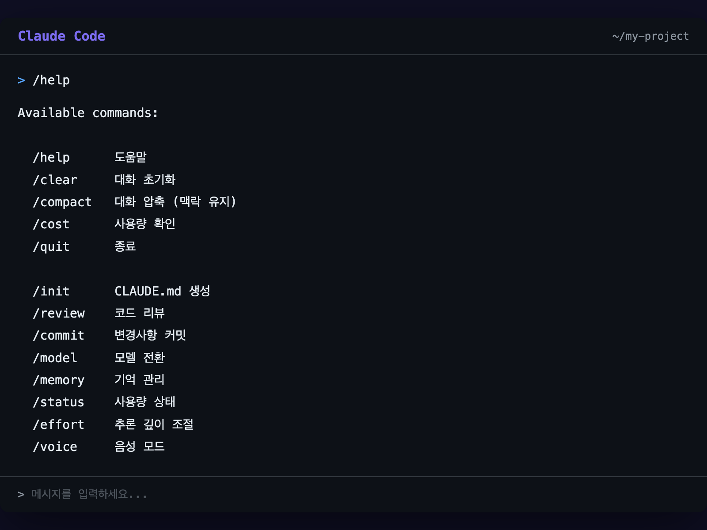

# 슬래시 커맨드 익히기

## 오늘의 목표

> 슬래시 커맨드로 Claude Code를 빠르게 조작하기

지금까지는 자연어로 대화했습니다. 이번에는 **슬래시 커맨드**라는 단축 명령을 배웁니다. 더 빠르고, 더 정확하게 Claude Code를 다룰 수 있습니다.

---

## 슬래시 커맨드란?

채팅 입력창에 `/`를 입력하면 나타나는 **특수 명령어**입니다.

`> /help`

일반 대화와 다른 점은:

| 일반 대화 | 슬래시 커맨드 |
| --- | --- |
| ”도움말 보여줘” | `/help` |
| Claude가 해석해서 실행 | **즉시** 실행 |
| 결과가 다를 수 있음 | 항상 같은 결과 |

슬래시 커맨드는 **Claude에게 부탁하는 게 아니라, Claude Code 앱 자체를 조작하는 것**입니다.

---

## 꼭 알아야 할 5개

이 다섯 개는 매일 씁니다. 반드시 기억하세요.

### 1. `/help` — 도움말

`/help`
사용 가능한 모든 명령어 목록을 보여줍니다. 뭐가 있는지 까먹었을 때 쓰세요.

**이럴 때 쓰세요**: “어떤 명령어가 있었더라?“

### 2. `/clear` — 대화 초기화

`/clear`
지금까지의 대화 내역을 **전부 지웁니다**. 새로운 주제로 넘어갈 때 쓰세요.

**이럴 때 쓰세요**: “이전 대화가 너무 길어져서 Claude가 헷갈리는 것 같을 때”

`/clear`를 하면 이전 대화 내용을 Claude가 더 이상 기억하지 못합니다. 중요한 맥락이 있었다면 다시 알려줘야 합니다.

### 3. `/compact` — 대화 요약

`/compact`
긴 대화를 **요약해서 압축**합니다. 대화가 길어져서 Claude의 응답이 느려질 때 쓰세요.

**이럴 때 쓰세요**: “대화가 길어졌는데, 맥락은 유지하고 싶을 때”

`/clear`와의 차이:

- `/clear`: 전부 날림 (백지 상태)

- `/compact`: 핵심만 남기고 압축 (맥락 유지)

### 4. `/cost` — 비용 확인

`/cost`
현재 대화에서 사용한 **토큰 수와 비용**을 보여줍니다.

**이럴 때 쓰세요**: “오늘 얼마나 썼지?”

Claude Code는 대화가 길어질수록 비용이 올라갑니다. `/cost`로 중간중간 확인하는 습관을 들이면 좋습니다.

### 5. `/quit` — 종료

`/quit`
Claude Code를 종료합니다. `Ctrl + C`를 두 번 누르는 것과 같습니다.

**이럴 때 쓰세요**: “오늘 작업 끝!”

---

## 편리한 5개

매일 쓰진 않지만, 알아두면 작업이 훨씬 수월해지는 명령어들입니다.

| 명령어 | 기능 | 이럴 때 쓰세요 |
| --- | --- | --- |
| `/init` | 프로젝트 설명서(`CLAUDE.md`) 생성 | 새 프로젝트를 시작할 때 |
| `/review` | 변경된 코드를 검토 | 코드가 괜찮은지 확인할 때 |
| `/commit` | 변경 사항 저장 (커밋) | 작업 내용을 기록할 때 |
| `/model` | AI 모델 변경 | 더 빠른 모델로 바꿀 때 |
| `/memory` | 기억 정보 확인/수정 | Claude가 뭘 기억하는지 볼 때 |
| `/status` | 남은 사용량 확인 | Pro/Max 구독 한도 확인할 때 |
| `/effort` | 추론 깊이 조절 (low/medium/high) | 간단한 작업은 low로 빠르게 |
| `/voice` | 음성 모드 전환 | 말로 지시하고 싶을 때 |

`/init`이 만드는 `CLAUDE.md`는 Day 2에서 자세히 다룹니다. 지금은 “프로젝트 설명서를 만드는 명령어”라고만 기억하세요.

---

## 키보드 단축키

슬래시 커맨드 외에도 알아두면 좋은 키보드 조작법이 있습니다.

| 키 | 동작 |
| --- | --- |
| `Esc` | 현재 Claude의 응답을 **중단**합니다 |
| `Ctrl + C` (2회) | Claude Code를 **종료**합니다 |
| `위/아래 방향키` | 이전에 입력했던 내용을 **다시 불러옵니다** |
| `Tab` | 파일 이름을 **자동 완성**합니다 |

가장 자주 쓰는 건 `Esc`입니다. Claude의 답변이 너무 길거나, 방향이 잘못됐다 싶으면 `Esc`를 눌러서 멈추고 다시 요청하세요.

## 실습: 직접 써보기

Claude Code를 실행하고 아래 명령어를 하나씩 입력해보세요:

1. `/help` — 전체 명령어 목록 확인

1. 아무 질문이나 하나 해보기 (“오늘 날씨 어때?” 같은 것)

1. `/cost` — 방금 대화에 얼마나 들었는지 확인

1. `/compact` — 대화 압축해보기

1. `/clear` — 대화 초기화하기

1. `/cost` — 비용이 리셋됐는지 확인

`실습 순서:

/help          → 목록 확인
"아무 질문"     → 대화 한 번
/cost          → 비용 확인
/compact       → 압축
/clear         → 초기화
/cost          → 다시 확인`
이 과정을 한 번 해보면 각 명령어의 차이가 체감됩니다.

---

## 빠른 참조 카드

자주 쓰는 명령어를 한눈에:

`/help     도움말 — "뭐가 있지?"
/clear    초기화 — "처음부터 다시"
/compact  압축   — "맥락 유지하면서 정리"
/cost     비용   — "얼마 썼지?"
/quit     종료   — "오늘 끝"

/init     설정   — "프로젝트 시작"
/review   리뷰   — "코드 괜찮아?"
/commit   저장   — "변경 사항 기록"
/model    모델   — "모델 바꾸기"
/memory   기억   — "뭘 기억하고 있어?"
/status   상태   — "사용량 얼마 남았지?"
/effort   깊이   — "가볍게/깊이 생각해"
/voice    음성   — "말로 시키기"`
---

## 정리

오늘 배운 것을 정리합니다:

- 슬래시 커맨드는 `/`로 시작하는 **즉시 실행 명령어**입니다

- 매일 쓰는 5개: `/help`, `/clear`, `/compact`, `/cost`, `/quit`

- 편리한 8개: `/init`, `/review`, `/commit`, `/model`, `/memory`, `/status`, `/effort`, `/voice`

- `Esc` 키로 Claude의 응답을 중단할 수 있습니다

- 대화가 길어지면 `/compact`로 압축하거나 `/clear`로 초기화하세요

---

**Day 1 완료!**

오늘 하루 동안 Claude Code의 기본을 모두 익혔습니다:

- 첫 대화를 나눴고

- 파일을 읽고 쓰는 법을 배웠고

- 자주 쓰는 5가지 패턴을 익혔고

- 슬래시 커맨드로 빠르게 조작하는 법을 배웠습니다

이제 기본은 됐습니다. Day 2에서는 **실제 프로젝트에 Claude Code를 적용**해봅니다. “연습”이 아니라 “실전”입니다.

> [Day 2로 넘어가기 →](/docs/day-2)
